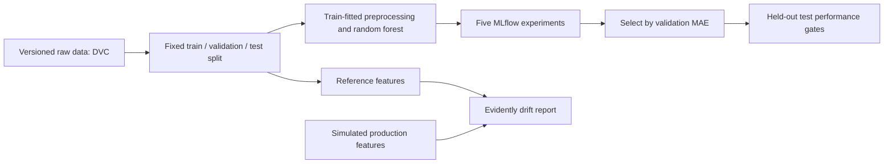

# Ames Housing MLOps

[](https://github.com/MichaelMartiradonna/ames-housing-mlops/actions/workflows/mlops.yml)

A reproducible machine-learning workflow for estimating historical home sale prices in Ames, Iowa. The project combines **Git and DVC**, **MLflow**, **pytest**, **GitHub Actions**, and **Evidently** around a compact random-forest model.

The objective is reliable model development: identifiable data versions, comparable experiments, explicit acceptance gates, and observable changes in incoming features. This repository demonstrates those practices locally and in CI; it does not operate a live valuation service.

## Verified results

- Selected model: 200-tree random forest, unlimited depth, minimum leaf size 1.
- Held-out test results: **MAE $17,773; RMSE $30,215; R² 0.886**, passing both planned acceptance gates.
- **18 passing tests**, including saved-model reload with missing values and an unseen category.
- Drift control: **0 of 14** predictors; simulated shift: **5 of 14 (35.71%)**, correctly returning an alert above 30%.

Full results and their limits are documented in [PROJECT_SUMMARY.md](PROJECT_SUMMARY.md).
Verification status is recorded in [reports/verification.json](reports/verification.json) and [CHECKLIST.md](CHECKLIST.md).

## Dataset and prediction task

The [original Ames Housing dataset](https://jse.amstat.org/v19n3/decock/AmesHousing.txt) describes **2,930 property sales from 2006–2010**. It contains 82 columns, including identifiers and the `SalePrice` target. The model uses 14 predictors:

- **Numeric:** lot area, lot frontage, above-ground living area, overall quality, year built, full bathrooms, garage capacity, basement area, and bedrooms.
- **Categorical:** neighborhood, house style, building type, zoning, and central air.

Lot frontage is missing for 490 records; garage capacity and basement area each have one missing value. Existing missingness provides a realistic preprocessing requirement. Identifiers and the sale price are excluded from predictors.

Ames was selected because it provides a documented regression target, mixed feature types, and manageable preparation. This keeps the work focused on the surrounding MLOps workflow. The historical data supports a reproducibility demonstration, not current market appraisals or forecasts for other locations.

Reference: Dean De Cock, [“Ames, Iowa: Alternative to the Boston Housing Data as an End of Semester Regression Project”](https://jse.amstat.org/v19n3/decock.pdf), *Journal of Statistics Education*, 19(3), 2011. The dataset is attributed to its original source; no ownership of the source data is claimed.

## Workflow and repository layout



- `src/`: configuration, data validation/storage, preprocessing, training, evaluation, experiment comparison, and monitoring.
- `configs/`: model settings and the checksummed data-release manifest.
- `tests/`: preprocessing, actual-data, model, and failure-path tests.
- `.github/workflows/`: automated testing followed by gated training.
- `data/raw/`: DVC-managed source data; only the pointer file is committed.
- `reports/`: compact experiment evidence, the MLflow screenshot, and drift reports.
- `artifacts/`: local MLflow database, models, and generated training outputs; excluded from Git.
- `.dvc-remote/`: portable local DVC storage; excluded from Git.

See [PROJECT_SUMMARY.md](PROJECT_SUMMARY.md) for decisions, findings, limitations, and prioritized future improvements; [CHECKLIST.md](CHECKLIST.md) records completion evidence.

## Setup

Prerequisites: **Python 3.12** and Git. Run commands from the repository root.

```bash
git clone https://github.com/MichaelMartiradonna/ames-housing-mlops.git
cd ames-housing-mlops
```

Create a virtual environment:

**Windows PowerShell**

```powershell
py -3.12 -m venv .venv
.\.venv\Scripts\Activate.ps1
```

**macOS / Linux**

```bash
python3.12 -m venv .venv
source .venv/bin/activate
```

Install the pinned project dependencies and restore the data:

```bash
python -m pip install -r requirements.txt
python -m pip check
python -m src.data_storage bootstrap
python -m dvc pull
```

### How data sharing works

The raw dataset is stored with DVC, not in Git history. A [GitHub Release attachment](https://github.com/MichaelMartiradonna/ames-housing-mlops/releases/tag/data-v1) contains the local DVC remote. The bootstrap command downloads that attachment, checks its SHA-256 digest and object manifest, and restores `.dvc-remote/`. `dvc pull` then retrieves the dataset using the committed pointer.

**The bootstrap step is required on a new computer before the first `dvc pull`.** The local remote configuration does not point to another person's computer. No additional service account, private token, or storage subscription is required for data restoration.

For an already downloaded attachment:

```bash
python -m src.data_storage bootstrap --archive /path/to/ames-dvc-remote-v1.zip
python -m dvc pull
```

## Training and experiment comparison

All model settings, predictor names, split proportions, random seeds, paths, validation ranges, and thresholds are defined in [configs/model.yaml](configs/model.yaml).

The split is fixed at **1,758 training / 586 validation / 586 test records**. Numeric medians, categorical modes, and encoder categories are fitted exclusively on the training partition. Unseen categories retain the expected feature shape.

Run the five configured experiments:

```bash
python -m src.run_experiments
python -m src.compare_experiments
```

The experiments vary tree count, tree depth, and minimum leaf size. Selection uses **validation MAE**, which expresses the typical absolute error in dollars. RMSE highlights larger misses; R² summarizes variance explained. Only the validation-selected winner receives a final test evaluation in this experiment batch.

Each run records effective model parameters, preprocessing settings, the DVC content hash, split sizes, source revision metadata, the configuration file, metrics, and the complete preprocessing/model pipeline. The model artifact includes an input signature and the custom preprocessing code.

The comparison command queries MLflow with `mlflow.search_runs()` and compares the latest batch for the current dataset version, requiring one completed run per configured experiment. It rejects incomplete batches. Repeating the experiment command creates a new batch; previous runs remain available locally.

Run the selected configuration and enforce test-set acceptance gates:

```bash
python -m src.train
```

Acceptance requires **MAE ≤ $35,000 and R² ≥ 0.75**. A failure produces a nonzero exit code. The committed selection is in `model.selected_experiment`; changing experiments requires reviewing the new validation comparison before updating that selection.

Experiment evidence:

- [Ranked experiment results](reports/experiment_comparison.csv)
- [Dataset findings, selected run, and test metrics](reports/experiment_summary.json)
- [MLflow experiment screenshot](reports/mlflow_experiments.png)

### View MLflow locally

```bash
python -m mlflow ui --backend-store-uri sqlite:///artifacts/mlflow.db --host 127.0.0.1 --port 5000
```

Open [localhost:5000](http://127.0.0.1:5000) and select `ames-housing`. Run the experiment command first in a fresh checkout. The local SQLite database and model files are intentionally excluded from Git; the committed evidence records the completed reference batch. CI maintains its own `ames-housing-ci` experiment and uploads its artifacts.

## Tests and continuous integration

```bash
pytest tests/ -v
```

The suite covers six preprocessing behaviors, three actual-data validation checks, and two model validation checks. The model fixture trains on a fixed 1,000-row subset of the training partition and predicts on the reserved test partition. Additional tests check performance-gate rejection, integrity/path handling for downloaded data, control and shifted monitoring results, and predictions after reloading an MLflow model artifact.

The [GitHub Actions workflow](.github/workflows/mlops.yml) runs on pushes to `main` and pull requests targeting `main`:

1. **Test job:** install dependencies, restore versioned data, and run the full pytest suite.
2. **Training job:** start only after successful tests, independently restore data, train the selected configuration, and enforce performance gates.

The workflow uses read-only repository permissions. Dataset restoration requires no secrets, including for pull requests from forks. Test results and training evidence are attached to the workflow run. [View Actions history](https://github.com/MichaelMartiradonna/ames-housing-mlops/actions/workflows/mlops.yml).

## Drift monitoring

Run the unchanged control:

```bash
python -m src.monitor_drift --scenario control
```

Run the deliberately shifted production simulation:

```bash
python -m src.monitor_drift --scenario drifted
```

The second command is **expected to exit with code 1** when drift share exceeds the configured 30% threshold. It writes the report before returning that alert status. An unexpected execution failure is reported separately with exit code 2.

Evidently evaluates all 14 raw predictors using explicit numerical and categorical definitions. The simulation changes lot area, lot frontage, living area, basement area, and neighborhood composition without altering the source dataset. Identifiers and target values are not monitored as predictors.

Open the generated `reports/drift_control.html` and `reports/drift_drifted.html` files in a browser. Compact JSON summaries accompany the reports. [MONITORING.md](MONITORING.md) explains which features drifted, the possible effect on model performance, and the recommended response.

## Reproducing the complete verification sequence

After setup:

```bash
pytest tests/ -v
python -m src.run_experiments
python -m src.compare_experiments
python -m src.train
python -m src.monitor_drift --scenario control
python -m src.monitor_drift --scenario drifted
```

Expect success from each command except the final deliberate drift alert. Review the experiment evidence, generated HTML reports, and Actions history alongside the documentation.

## Maintainer data preparation

The source version and release bundle are already prepared. To reproduce their construction:

```bash
python -m src.data_storage acquire
python -m dvc add data/raw/AmesHousing.tsv
python -m dvc push
python -m src.data_storage package --repository MichaelMartiradonna/ames-housing-mlops
```

The acquisition command rejects source bytes that differ from the approved SHA-256 digest. Changing the dataset version requires reviewing the data, updating its checksums and DVC pointer, and publishing a corresponding release attachment. Do not overwrite an existing release with different bytes while retaining its manifest.

## Boundaries

This project demonstrates a reproducible local and CI workflow. It does not include serving infrastructure, live property data, automated retraining, or operational paging. Those would need additional requirements and validation. The retrospective separates implemented controls from future recommendations.
