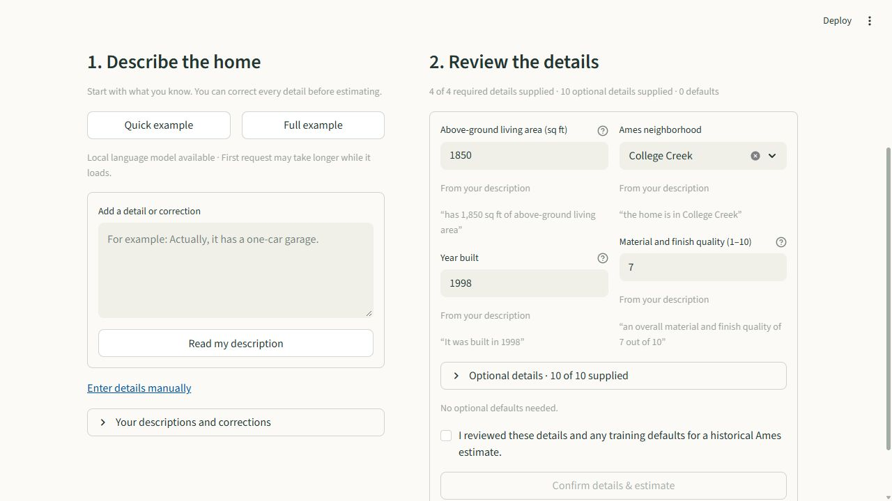
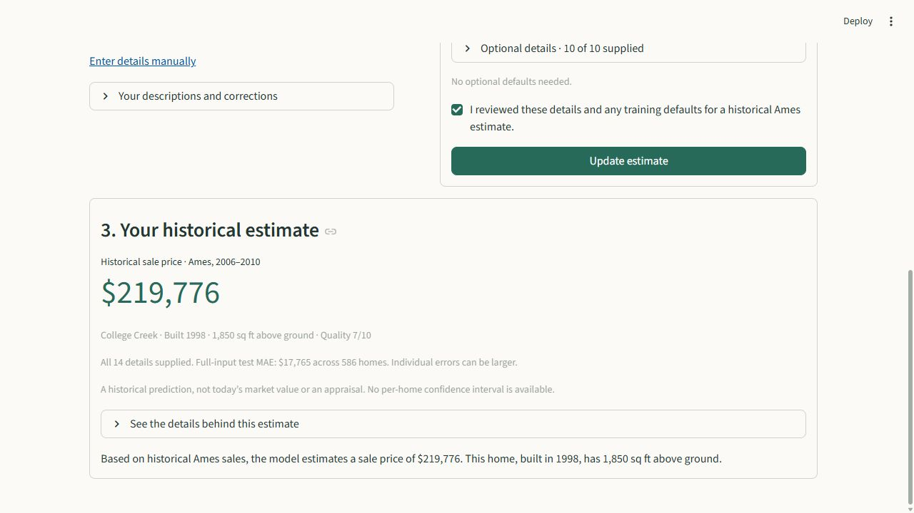
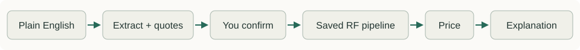

# Ames Home-Price Lab

## For a hiring manager

Describe a home in plain English.\
A small local language model extracts the details into a form you can check and correct.\
Missing optional details use clearly labeled defaults from the training data.\
A saved Random Forest estimates a historical price, and the language model explains the result.\
The app covers Ames, Iowa sales from 2006–2010 and handles out-of-scope requests, such as a Chicago condo.\
On 586 held-out Ames homes using all 14 features, average error (MAE) was about **$17,765**.\
That is about **72% lower error** than a “guess the training median” baseline, whose MAE was **$63,823**.\
It estimates historical prices—not today’s market value or a professional appraisal.

**[Watch the demo · 5:45](https://youtu.be/1mW6WnJn5k4)** — earlier interface, same price model.

## Try it

1. Choose **Quick example** or **Full example**, then **Read my description**.
2. Check the details against their quotes; edit anything the model misread.
3. Supply living area, neighborhood, year built, and quality. Review optional defaults.
4. Check the review box, then **Confirm details & estimate**. Price first, explanation next.
5. Correct the garage capacity, review, and choose **Update estimate**.
6. Try a Chicago condo; the app explains its scope and declines.

## A worked example

A fictional College Creek home: 1998, 1,850 sq ft, quality 7/10. All fourteen details supplied; no defaults.

<details>
<summary>Copy the full description</summary>

> For a historical Ames estimate, the home is in College Creek. It was built in 1998, has 1,850 sq ft of above-ground living area, and an overall material and finish quality of 7 out of 10. It is a two-story single-family detached house with low-density residential zoning and central air. It has a 2-car garage, 900 sq ft of basement area, 2 above-ground full bathrooms, 3 above-ground bedrooms, a 10,500 sq ft lot, and 80 ft of street frontage.

</details>



After confirmation: **$219,776**, calculated by the saved pipeline and explained by the language model.



## How it works



## Results

Five Random Forests compared; lowest validation MAE selects the model. Errors are in dollars.

| Trees / depth / min leaf | Validation MAE | Test MAE | Test RMSE | Test R² |
| --- | ---: | ---: | ---: | ---: |
| **200 / unlimited / 1 (selected)** | **$16,639** | **$17,765** | **$30,245** | **0.886** |
| 100 / unlimited / 1 | $16,696 | $17,868 | $30,294 | 0.886 |
| 200 / 12 / 2 | $16,721 | $17,624 | $29,959 | 0.888 |
| 200 / unlimited / 3 | $16,809 | $17,752 | $29,360 | 0.892 |
| 100 / 6 / 1 | $18,242 | $19,724 | $32,845 | 0.865 |

[Run details and metrics](reports/experiment_comparison.csv)

## Limits

- Historical Ames only; no current-market valuations.
- Metrics use all fourteen features. Defaults can reduce accuracy; average error is not a guaranteed range.
- Check language extraction. **Zero means none; blank means unknown.**

## Run locally

Use **Python 3.12** in a virtual environment, with [Ollama](https://ollama.com/download) running. From the repository folder:

```bash
python -m pip install -r app/requirements.txt
ollama pull qwen3:4b
python -m streamlit run app/streamlit_app.py
```

Open [localhost:8501](http://localhost:8501). The housing model downloads automatically. No API key; the first request can be slow.

[Docker setup](docs/DOCKER_WALKTHROUGH.md) · [Technical notes and project history](docs/TECHNICAL_GUIDE.md)
